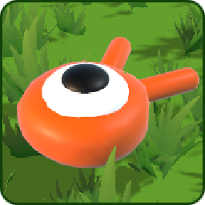
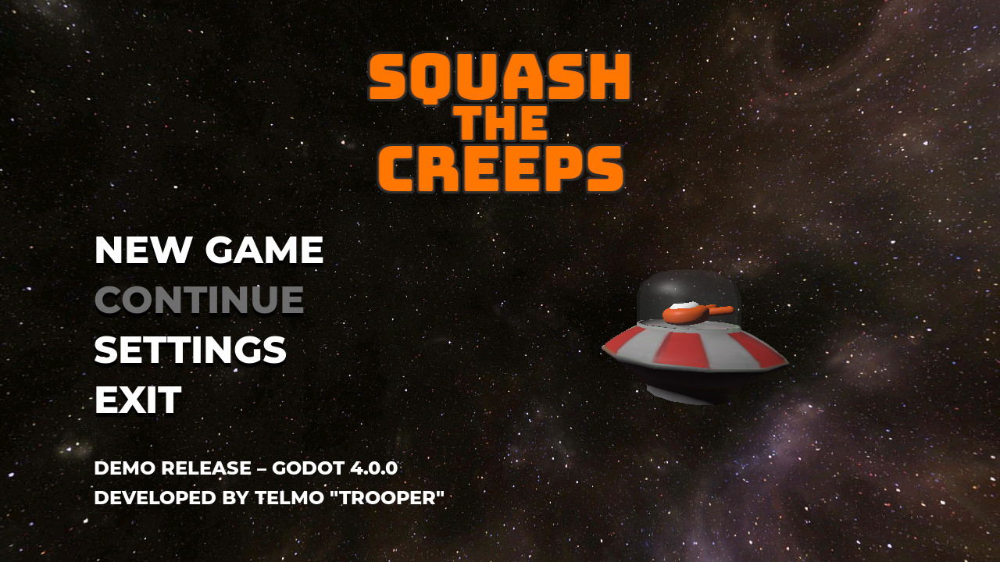
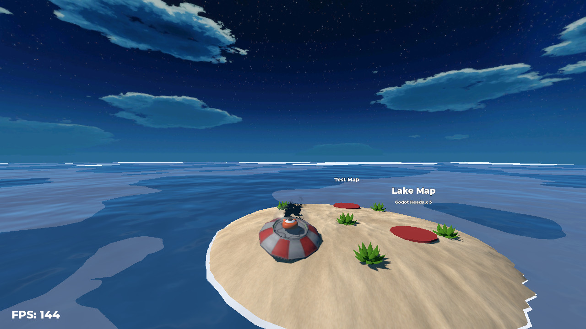
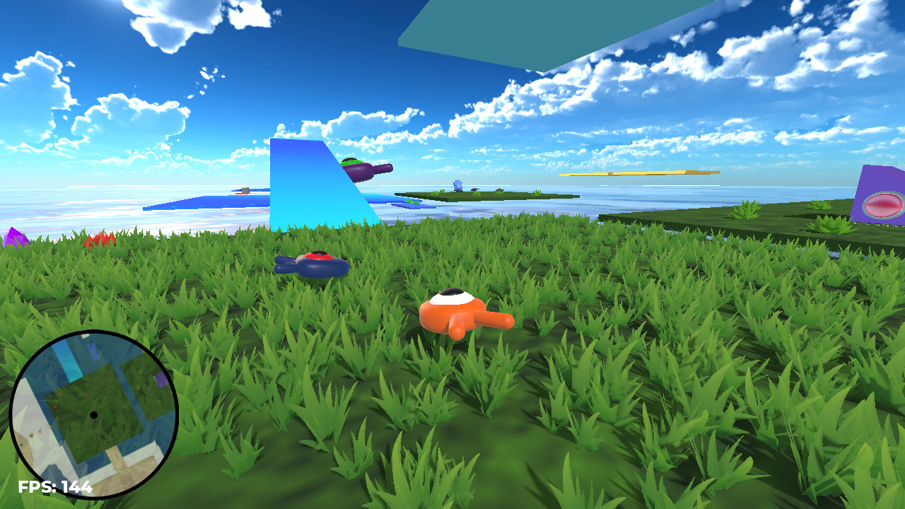

#  Squash the Creeps 

**Squash the Creeps** is a freeware game developed in the [Godot Engine](https://godotengine.org/) where you control a squid-like creature and squash incoming enemies.

It is based in the isometric 3D game of the same name implemented in the tutorial [Create Your First Complete 3D Game with Godot](https://youtu.be/YiE9tcoCfhE) by [GDQuest](https://www.gdquest.com/).

Third party assets used are listed under [CREDITS](repo/CREDITS.md).

## Download

You can **[download here](https://github.com/telmotrooper/squash-the-creeps/releases/latest)** the latest version of the game for Windows, Linux and Mac, thanks to the wonderful [Godot Export](https://github.com/firebelley/godot-export) GitHub Action.

## Screenshots

## FAQ

#### **Where are the settings stored?**

* Windows: `%APPDATA%/Godot/app_userdata/Squash the Creeps/settings.cfg`
* Linux: `~/.local/share/godot/app_userdata/Squash the Creeps/settings.cfg`
* Mac: `~/Library/Application Support/Godot/app_userdata/Squash the Creeps/settings.cfg`

#### **(Editor) I'm getting error "Mixed tabs and spaces in indentation"**

If you get this error, go in the editor and click `Editor > Editor Settings... > General > Text Editor > Indent`, then change **Type** to `Spaces` and **Size** to `2`. Then close the project, reset the file changes with `git reset --hard` and reopen the project. You should now be able to edit the files without running into the error.

#### **(Editor) I'm getting error "Unable to load addon script from path"**
For some reason, the first time you open the project in Godot you'll get this error and the plugins used in the project will be disabled. You should be able to fix it just by running `git checkout HEAD project.godot` to reset the changes.

#### **(Editor) I'm getting error "Scene '...' has broken dependencies: '...'.blend"**
Since the project now relies on `.blend` files, you'll have to have [Blender](https://www.blender.org/) installed in your system and set up in the Godot Editor. To do so, go to `Editor > Editor Settings... > FileSystem > Import` and in `Blender 3 Path` set the path where Blender is installed. Some possible values might be:
* Arch Linux: `/usr/bin`
* Windows: `C:/Program Files/Blender Foundation/Blender 3.4`

#### **(MacOS) "Squash the Creeps.app" is damaged and can't be opened**

The application isn't signed, so you'll have to disable the checks running the following command `xattr -cr "Squash the Creeps.app"` in the folder where the game is.
